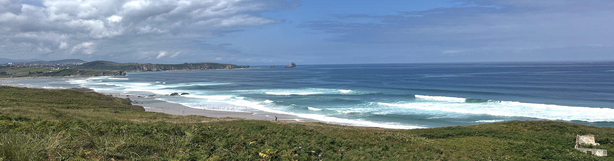

# Dr. Laura Cagigal

I am a coastal engineer and researcher specializing in **climate-based emulators**, **coastal hazards** and **wave downscaling**. Currently, I collaborate as a postdoctoral researcher with the [GeoOcean Group](https://geoocean.sci.unican.es/hyweb) at Universidad de Cantabria, and work as a freelance researcher with Arizona State University 🌊✨  
My work focuses on bridging **large-scale climate** and **coastal impact assessments** through statistical and hybrid modeling approaches.

## 🌟 About Me:
- 🔬 I develop statistical and hybrid models to simulate coastal processes under climate change scenarios
- - 🧠 Interested in combining physics-based models with data-driven approaches  
- 🔭 I’m currently working on climate-related coastal research and on the development of open source repositories.
- 🛠️ Strong background in Python, scientific computing, and large-scale data analysis  
- 📫 Reach me at: [laura.cagigal@unican.es](mailto:laura.cagigal@unican.es)

## 🗂️ My Repositories
- [Pacific Climate Indicators - report](https://github.com/lauracagigal/CC_indicators_report): Palau - climate indicators report
- [Pacific Climate Indicators](https://github.com/lauracagigal/CC_indicators): Palau - atmospheric and ocean climate indicators
- [Pacific Climate Indicators - setup](https://github.com/lauracagigal/indicators_setup): setup codes for climate indicators

